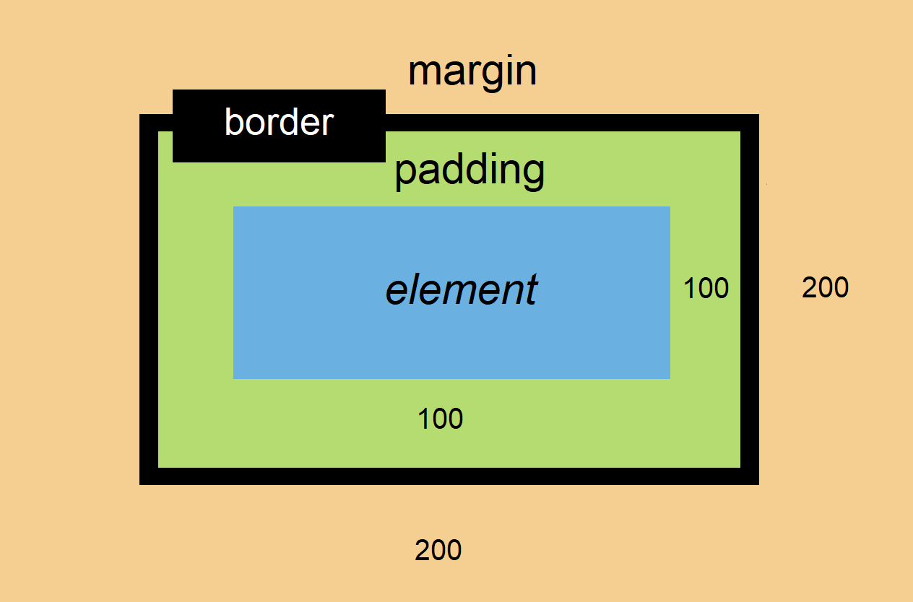

# HTML E CSS

## Sumário

- [HTML](#HTML)

  - [O que é HTML](#O-que-é-HTML)
    - [O Elemento](#O-Elemento)
      - [Criando um elemento](#Criando-um-elemento)

  - [Estrutura básica de um documento HTML](#Estrutura-básica-de-um-documento-HTML)
  - [Elementos do HTML](#Elementos-do-HTML)
    - [Elementos Especiais Listas](#Elementos-Especiais-Listas)
  - [Estrutura básica de um documento HTML enriquecida](#Estrutura-básica-de-um-documento-HTML-enriquecida)
  - [Atributos do HTML](#Atributos-do-HTML) 
    - [Atributos importante do HTML](#Atributos-importante-do-HTML)
  - [A Caixa de cada elemento HTML Box Model](#A-Caixa-de-cada-elemento-HTML-Box-Model)


## HTML

### O que é HTML

Um texto, na internet ou fora dela, pode ter títulos, subtítulos, parágrafos, listas, certo?

A linguagem HTML permite que todos estes elementos (e muitos outros) sejam estruturados numa página. Não só os títulos e parágrafos, por exemplo, mas também cabeçalhos, rodapés, imagens, vídeos, tabelas e mais.

#### O Elemento

O **elemento** é a base do HTML. Um parágrafo no texto, uma lista ou um título são exemplos de elementos.


##### Criando um elemento

Para criar um elemento, é necessário escrever a **tag de abertura**, o **conteúdo** e a **tag de fechamento**, como estão nas linhas 1, 2 e 3, respectivamente:

```html
<h1 class= "titulo">
    Megan Thee Stalion
</h1>
```

Este `class="titulo"` é chamado de **atributo**, dentro da tag de abertura. Em breve teremos mais detalhes sobre atributos.

### Estrutura básica de um documento HTML

Organizar todos os elementos que compõem uma página não é uma missão fácil. Pensando nisso, é convenção da linguagem deixar cada coisa em seu lugar.

No ***head*** ficam as coisas que não vemos necessariamente na página, como a palavra que aparece na aba do navegador e as configurações de caracteres (*meta charset='utf-8'* na linha 4 abaixo ajuda nossa página a exibir as palavras certinhas, com todos os acentos e ~). 

No ***body*** teremos aquilo que o usuário vê, como as imagens, textos, tabelas e cores.

```html
<!DOCTYPE html>
<html>
    <head> 
        <meta charset='utf-8'>
        <title>"Aba do meu site"</title>
    </head>
    <body>
    </body>
</html>
```


### Elementos do HTML

Lembra que, para começar um elemento, precisamos da tag de abertura? Então: é a tag de abertura que carrega o que cada elemento faz. Essa organização é a **semântica** do HTML. Cada vez que você achar algum destes nomes na tag, já vai saber a finalidade dele:

1. `header`: É o cabeçalho uma página ou de parte de uma página;
2. `h1` - `h6`: São os títulos dos textos da página. Só pode haver um `h1`por página;
3. `p`: É o parágrafo, conteúdo do artigo. Suporta imagem, código, vídeo e vários tipos de conteúdo;
4. `article`: É um conteúdo de destaque dentro do texto;
5. `aside`: Conteúdo relacionado ao conteúdo principal;
6. `section`: Seção genérica como uma lista de arquivos;
7. `footer`: Rodapé da página ou de parte da página;
8. `a`: É uma âncora, interligando vários atributos. Geralmente usada para criar um link clicável, unindo um texto a uma página web externa, como aqueles <a href=https://github.com/marianavns>CLIQUE AQUI</a> que vemos em alguns sites;
9. `img`: Permite adicionar a imagem. Importante: Só tem 2 atributos próprios, o src e o alt. Mas...  o que é atributo? Sem tag de fechamento.

10. `ul` (*unordered list*): a ordem dos itens não é importante. Tudo o que você terá é uma lista sem números.

11. `ol` (*ordered list*): a ordem dos itens é importante sim e eles vâo aparecer antes de cada item.

12. `li` (*list icon*) : Feche cada item da sua lista com esta tag.

    


    ✏️ **Exemplo de** ***lista não ordenada*** **e como ela fica**:
    
    ```html
    <ul>
        <li>Joe Biden</li>
        <li>Barack Obama</li>
        <li>Donald Trump</li>
    </ul>
    ```
    
    <ul>
        <li>Joe Biden</li>
        <li>Barack Obama</li>
        <li>Donald Trump</li>
    </ul>


    ✏️**Exemplo de** ***lista ordenada*** **e como ela fica**
    
    ```html
    <ol>
        <li>Joe Biden</li>
        <li>Barack Obama</li>
        <li>Donald Trump</li>
    </ol>
    ```
    
        <ol>
            <li>Barack Obama</li>
            <li>Donald Trump</li>
            <li>Joe Biden</li>
        </ol>


​    

### Estrutura básica de um documento HTML enriquecida

Aqui foram acrescentados no body alguns dos elementos vistos no tópico anterior.

```html
<!DOCTYPE html>
<html>
    <head> 
        <meta charset='utf-8'>
        <title>"Aba do meu site"</title>
    </head>
    <body>
        <header>
        </header>
        <article>
            <p>
            </p>
            <p>
                
                <ol> </ol>
            </p>
        </article>
        <footer></footer>
    </body>
</html>
```


### Atributos do HTML

Atributo é uma característica de um elemento. 

✏️ **Exemplo de atributos em imagem e como ela fica:**

```html

```

e é este o resultado:


Neste caso, o **elemento `img` tem duas características, ou atributos**: 

- `src`, que mostra em que lugar está hospedada a imagem e 

- `alt`, que descreve a cena que está na imagem.

#### Atributos importante do HTML

Alguns atributos são usados com bastante frequência e precisam ser lembrados aqui:

- `target`: Atributo da âncora. Ao criar um link no seu texto com o elemento `a` (âncora), o target vem logo em seguida e aponta se o link será aberto numa nova aba ou na mesma aba, por exemplo.
- `width`: Atributo que especifica a largura da imagem.
- `height`: Atributo que especifica a altura da imagem.

### A Caixa de cada elemento HTML Box Model

Os elementos podem ter várias "bordas" dentro de uma página html. Não são todos bordas, mas vamos imaginar assim por enquanto. 

São *padding*, *border* e *margin*. 




## CSS

CSS quer dizer *Cascading Style Sheets*, ou **folhas de estilo em cascata**. É um mecanismo para adicionar estilo a um documento web. É o CSS quem muda o tamanho e cor de títulos, de imagens, dos links, mas de forma organizada. E, para organizar, você cria regras de estilo para grupos, seja grupo de títulos, de imagens, etc. É possível fazer isso só via HTML? É. Mas não fica padronizado e as possibilidades são mais restritas.

### Editando elementos HTML pelo tipo

No exemplo abaixo, estamos editando as âncoras (*a*), os parágrafos (*p*) e o título principal (*h1*) de um documento web. *a*, *p* e *h1* são chamados **tipos HTML**. Aqui, todos eles serão azuis e terão o tamanho 14 de fonte.

```css
a, p, h1 {
   color: blue
   font-size: 14px
}
```

Mas, peraí, isso seria um pouco estranho, né? Nem sempre queremos deixar **todos** os parágrafos da mesma cor, ou âncoras do mesmo tamanho. É interessante fazer uma diferenciação. Aí que entram as **classes**. 

### Editando elementos HTML pelo seletor classes

Classes são grupos que criamos dentro do documento HTML, a fim de conseguir formatar elementos em blocos. No exemplo abaixo, temos apenas parágrafos, mas divididos em duas classes: *poesia* e *descricao-da-autoria*.

No arquivo HTML fica assim:

```html
<p class='poesia'>
“[...] Eu não te ordeno, te peço,
Não é querer, é desejo;
São estes meus votos - sim.
Nem outra cousa eu almejo.
E que mais posso eu querer?
Ver-te Camões, Dante ou Milton,
Ver-te poeta - e morrer."
</p>

<p class='descricao-da-autoria'>
    Maria Firmina dos Reis, nascida em São Luís (MA), foi pioneira ao lançar Úrsula (1859), o primeiro 		romance publicado por uma mulher negra em toda a América Latina – e primeiro romance abolicionista de autoria feminina em língua portuguesa –, cujo enredo engloba o ponto de vista do negro.
</p>

<p class='poesia'>
"[...] Para a infância negra
construiremos um mundo diferente
nutrido ao axé de Exu
ao amor infinito de Oxum
à compaixão de Obatalá
à espada justiceira de Ogum

Nesse mundo não haverá
trombadinhas
pivetes
pixotes
e capitães-de-areia."
</p>

<p class='descricao-da-autoria'>
    Abdias Nascimento (1914 – 2011) foi escritor, político, artista plástico, teatrólogo, ativista do movimento negro e poeta. Possui uma obra vasta, incluindo o livro de poesias Axés do sangue e da esperança: Orikis (1983).  
</p>
```

E no arquivo CSS, fica assim:

```css
.poesia {
    color: pink
    background-color: green
}

.descricao-da-autoria {
    color: black
    text-align: justify
}
```

Desta forma, todas as vezes que for necessário alterar a formatação de todas as poesias do documento, é só ir no arquivo CSS e editar a classe *poesia*. O mesmo para a classe *descricao-da-autoria*.

### Editando elementos HTML pelo seletor id

Existe ainda uma situação mais específica: o elemento não está numa classe, ele é unico. Pensando nisso, pode-se criar para este elemento um ID. No exemplo abaixo, usaremos o h1, que deve ser único em qualquer documento.

Exemplo no HTML:

```html 
<h1 id=titulo-principal>HTML e CSS</h1>
```

Como ele fica no CSS:

```css
#titulo-principal {
    color: black
    font-size: 30px
}
```


>  ⚡ Em CSS, **classe é ponto** e **id é hash**. Pra frisar: Um id só pode ser usado uma vez na página. Eles podem representar qualquer tipo de elemento.

Existem muitos outros seletores, ou seja, muitas outras palavrinhas que servem para selecionar elementos. Por enquanto, ficaremos com ID e classe, que são as principais.

### Colorindo o box model com a ajuda do CSS

Lembra que falamos sobre a caixa de cada elemento HTML, composta por element, padding, border e margin? O CSS permite colorir cada parte do boxmodel, como no exemplo abaixo:

```html
.post {
padding: 10px 5px;
border: 3px solid black;
margin: 10px;
background: blue;
}
```

Aqui estamos colorindo o box model de todos os elementos na classe *.post* .

### Propriedades CSS

> 📚 Documentação das propriedades CSS no [MDN Mozilla](#https://developer.mozilla.org/pt-BR/docs/Web/CSS/CSS_Reference).

Temos visto termos nos exemplos como "color", "background-color", "border", "text-align", dentre outros. Todos eles são **propriedades CSS**. São palavras, já preestabelecidas pelo CSS, para alterar o visual dos elementos selecionados. 

Sendo assim, não adianta digitar "cor-de-fundo: blue" no seu CSS e esperar que algo aconteça. O termo certo para mudar a cor de fundo é "background" ou "background-color".

#### Propriedades gerais

Algumas propriedades podem ser usadas em todos, ou quase todos, os tipos de elemento, seja parágrafo, artigo, imagem... Aqui estão algumas delas.

| Propriedade                                      | Finalidade                                                   | Possibilidades      |
| ------------------------------------------------ | ------------------------------------------------------------ | ------------------- |
| *padding*                                        | Espaçamento no topo, direita, inferior e esquerda. Gira em sentido horário. | 10px 20px 30px 40px |
| *padding-top*, *-right*, *-bottom* e     *-left* | Espaçamento se quiser configurar um por um.                  |                     |
| *width*                                          |                                                              |                     |
| *height*                                         |                                                              |                     |
| *max-width*                                      | Usado para que os elementos se adequem a todas as telas      |                     |
| *max-height*                                     |                                                              | top                 |
| *margin*                                         |                                                              | auto*               |
| *border-top, -right, -bottom, -left***           |                                                              |                     |
| *background-position*                            |                                                              |                     |
| *background*                                     | Altera o fundo do elemento.                                  |                     |
| *background-color*                               | Altera a cor de fundo do elemento.                           |                     |
| *background-image*                               | Altera a imagem de fundo do elemento.                        |                     |
| *border-radius*                                  | Arredonda os cantos do elemento.                             |                     |

*assim o conteúdo sempre fica alinhado.

**boa prática: quando trabalhar com espaçamento entre elementos com bordas, altere todas as bordas de cima ou todas as bordas de baixo.

#### Propriedades para formatar texto

| Propriedades      | Finalidade                     | Possibilidades                    |
| ----------------- | ------------------------------ | --------------------------------- |
| *text-align*      | Alinha o texto.                | center, justify, left.            |
| *font-family*     | Define qual a fonte.           | verdana, arial.                   |
| *font-size*       | Define o tamanho da fonte.     | 12px, 20px.                       |
| *font-style*      | Define o estilo da fonte.      | italic, normal.                   |
| *font-weight*     | Define o peso da fonte.        | bold, normal.                     |
| *text-transform*  | Transforma o texto já escrito. | uppercase, lowercase, capitalize* |
| *text-decoration* |                                |                                   |

*as primeiras letras de cada palavra ficam todas maiúsculas.

#### Propriedades para formatar listas

ul {

list-style-type: square

list-style-type: none

zere o padding e a margem, que o navegador bota por padrao... ou coloque pelo menos 10 pra nao ficar colado

}

### Enxugando as linhas do CSS

```css
.post {
    border-width: 3px;
    border-color: #505050;
    border-style: solid;
}
```

OU

```CSS
.post {
    border: 3px solid #505050
}
```

😉


